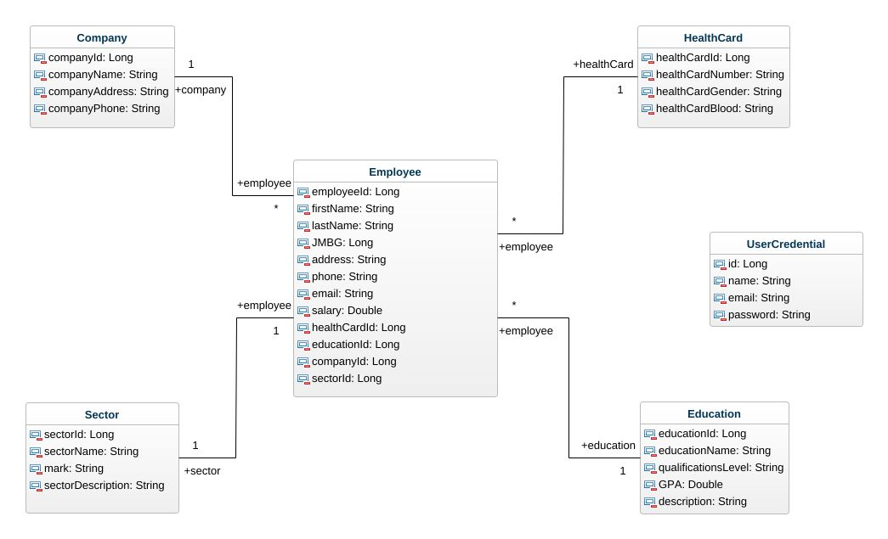
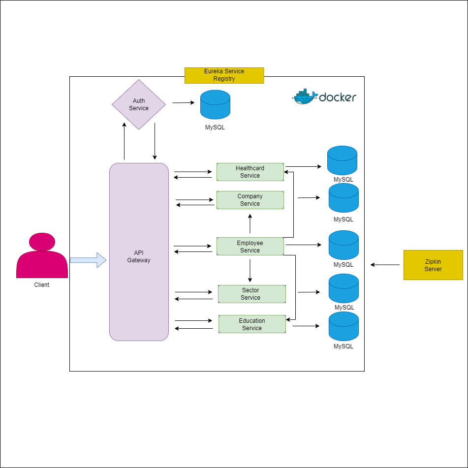

# DIS-project
# 🧠 Business Logic Overview

The application developed for this project demonstrates the operation of various microservices and their intercommunication. A total of eight microservices have been implemented, with the core logic centered around the **Employee microservice**. This service communicates with the **Education**, **HealthCard**, **Sector**, and **Company** microservices, incorporating all necessary security checks to ensure successful interactions and data retrieval.

# 🔐 Security & Authentication

JWT authentication is implemented using **Spring Cloud Gateway**, with an **Identity Service** facilitating secure user authentication and authorization. Access to each microservice via the API Gateway requires successful user authorization.

# 🔄 Service Discovery & Load Balancing

A **Naming Server** microservice registers instances of each microservice, handling incoming user requests and distributing them appropriately, effectively managing load balancing.

# 🛡️ Fault Tolerance & Rate Limiting

An **API Gateway** microservice routes requests to the appropriate microservices and incorporates:

- **Circuit Breaker**: Provides fallback methods when a microservice fails to respond.
- **Rate Limiter**: Restricts the number of requests to specific functionalities within a defined time period.
- **Bulkhead**: Limits the number of concurrent calls to prevent system overload.

# 🧭 Distributed Tracing

A **Tracing System** monitors the execution flow of requests across microservices, providing insights into the request journey and aiding in pinpointing errors for effective monitoring and debugging.

# 🐳 Containerization & Deployment

Each microservice is containerized using **Docker**, with images published to **Docker Hub**. A `docker-compose.yml` file is provided to facilitate seamless building and running of the application across different environments.

## Class diagram

## Microservice architecture

